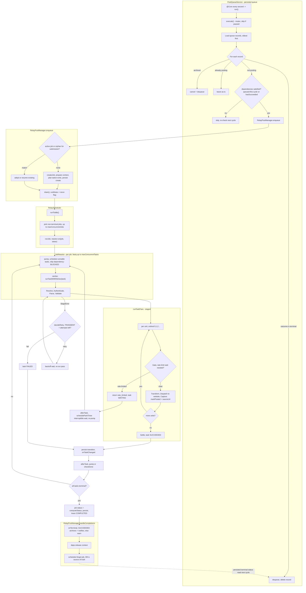

# Queue → Post Completion Flow

High-level flow of a submission from the persisted post queue through the Relay
engine to a completed post. See the linked sources for detail:

- `services/post-queue/post-queue.service.ts` — the persisted queue + cron cycle
- `engine/post-manager.service.ts` — orchestration entrypoint (`enqueue`, `drain`)
- `engine/scheduler.ts` — job registry + job-level concurrency
- `engine/job-reactor.ts` — per-job task reactor (event-driven, no polling)
- `engine/task-pass.ts` — the staged per-task pass
- `engine/persistence.ts` — durable job-tree state

> Rendering note: GitHub and Mermaid-aware viewers render this natively. VS Code's
> built-in Markdown preview needs the "Markdown Preview Mermaid Support" extension
> (or paste the block into https://mermaid.live to view/validate it).

## Reading the diagram

- **Queue layer** decides *what* runs: it dequeues finished entries (via
  `getOutcome`, scoped by the record's `createdAt`), holds dependency-gated
  ones, and hands eligible submissions to the engine. It never blocks on a
  running job — `enqueue`'s `drain()` is fire-and-forget.
- **Manager** turns a submission into a planned, persisted job tree, deduping
  against any live/orphaned job, then kicks the serialized `drain` loop.
- **Scheduler** runs up to `maxConcurrentJobs` job trees at once; **JobReactor**
  runs up to `maxConcurrentTasks` tasks per job via `fastq`, event-driven.
- **Staged pass** runs shared stages once (Resolve→Validate), then each batch
  **unit** in ascending ordinal order (Gate→Transform→Dispatch→Capture).
  Rate-limit gating **parks** the task (WAITING) rather than failing; genuine
  failures flow through the **retry policy** (TRANSIENT only, bounded backoff).
- **Completion** closes the loop: the job persists its terminal status,
  `handleCompletions` archives/notifies and forgets the job, and the *next*
  queue cycle observes that outcome via `getOutcome` and dequeues the record.

The dashed edge is the async hand-off: the queue and engine are decoupled, and
the persisted job status is what links "post completed" back to "record
dequeued."
