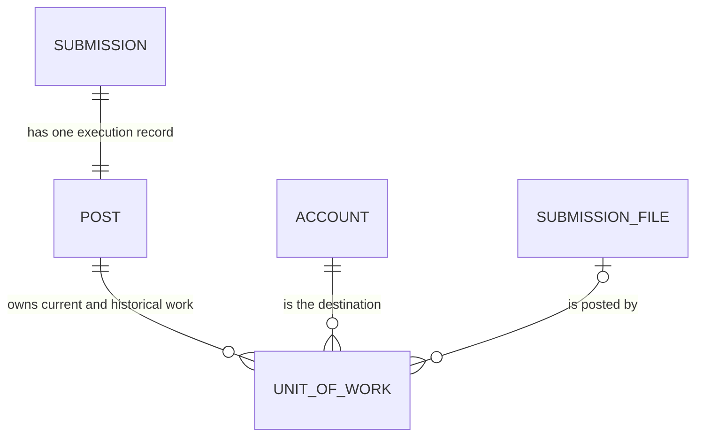
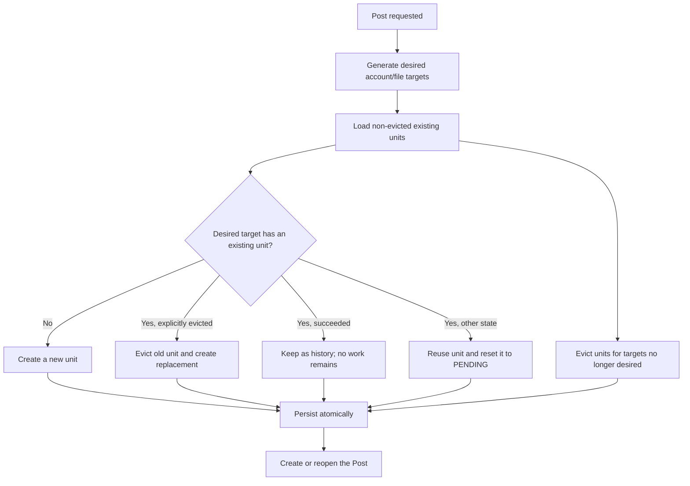
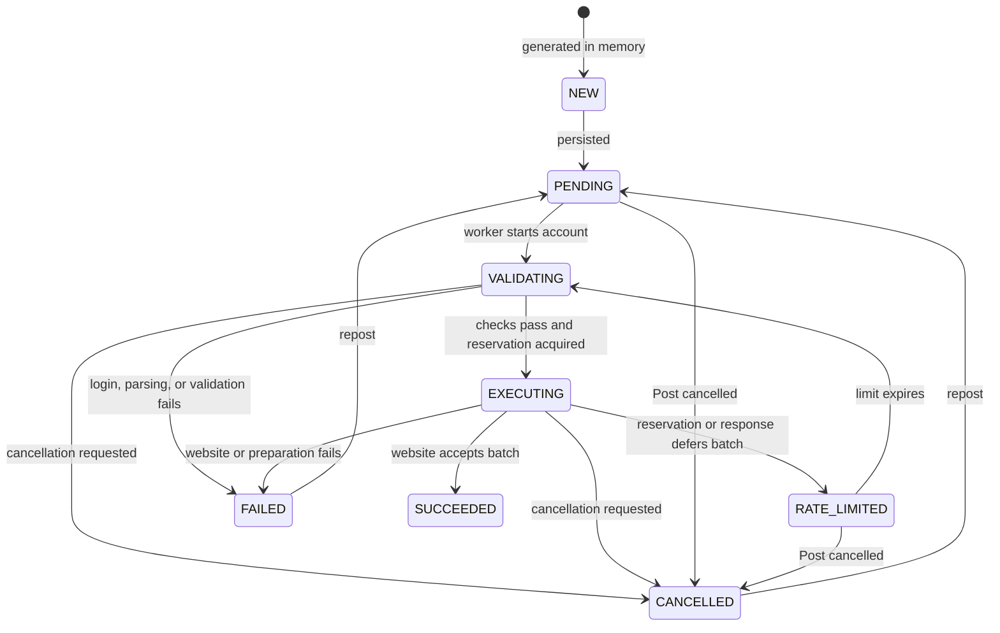
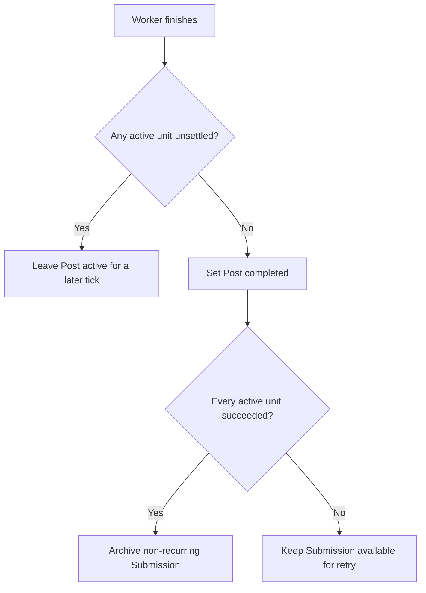

# Posts and Units of Work

This document explains the current posting model for contributors. It focuses on
the code in `apps/client-server/src/app/posting`; similarly named `PostRecord`,
`PostQueueRecord`, and post event classes belong to the legacy posting model and
its migration support.

## Mental model

- A **Submission** is the user's editable content and destination settings.
- A **Post** is the execution record for one Submission. It says whether that
  execution is active, completed, or explicitly cancelled.
- A **UnitOfWork** is the smallest persisted posting target: one account and,
  for file submissions, one file.

The relationship is:



`post.submissionId` is unique, so a Submission has at most one Post row. Reposts
reopen that row; they do not create a chain of Post rows. A Post keeps all of its
UnitOfWork rows so prior attempts remain available as history.

For example, two files targeting three accounts normally produce six units:

```text
account-a + file-1    account-a + file-2
account-b + file-1    account-b + file-2
account-c + file-1    account-c + file-2
```

A file's ignored-website list can remove individual combinations. A submission
without files produces one UnitOfWork per target account, with no `fileId`.

## Important fields

### Post

| Field          | Meaning                                                            |
| -------------- | ------------------------------------------------------------------ |
| `submissionId` | The Submission this Post executes. It is unique in the Post table. |
| `completed`    | Every active UnitOfWork has settled, or the Post was cancelled.    |
| `cancelled`    | The user or system explicitly cancelled the whole Post.            |
| `unitsOfWork`  | Current and historical work associated with the Post.              |

`completed` does **not** mean every destination succeeded. A Post is complete
when all non-evicted units are in `SUCCEEDED`, `FAILED`, or `CANCELLED`. Inspect
the units to determine the outcome.

### UnitOfWork

| Field                 | Meaning                                                                 |
| --------------------- | ----------------------------------------------------------------------- |
| `postId`              | The owning Post.                                                        |
| `submissionId`        | The source Submission. Denormalized for direct queries and projections. |
| `accountId`           | The destination account.                                                |
| `fileId` / `fileHash` | The source file identity, when the Submission has files.                |
| `batch`               | Groups files that a website must receive together.                      |
| `state`               | The current lifecycle state.                                            |
| `data`                | Parsed post data captured before validation and sending.                |
| `response` / `url`    | The website response and resulting source URL.                          |
| `rateLimitedUntil`    | The earliest time a rate-limited batch may run again.                   |
| `evicted`             | Excludes an old row from execution while retaining it as history.       |

The logical identity of a target is its composite key:

```text
submissionId + accountId + fileId
```

The optional `fileId` is empty for work that does not target a specific file.

## Creating and reconciling work

`PostingService.post()` is used for both first posts and reposts. It rejects a
request if the Submission's existing Post is still active. Otherwise it builds
the desired targets from the Submission's current files and non-default website
options, then reconciles those targets with non-evicted persisted units.



This gives reposting its key behaviors:

- Successful targets are skipped by default.
- Failed, cancelled, and unfinished targets are reused and returned to
  `PENDING`.
- Newly added files or accounts create new units.
- Removed files, accounts, and ignored targets cause their units to be evicted.
- Explicitly retrying a successful target evicts the old unit and creates a
  fresh replacement.

Eviction is a soft delete. Execution and completion queries ignore evicted rows,
but history views can still show what happened. New units are assigned stable
batches using the website's `fileBatchSize`; reused units keep their batch.

Recurring schedules deliberately evict all current work and create a fresh
generation for the next occurrence while continuing to reuse the same Post row.

## UnitOfWork lifecycle



| State          | Meaning                                                                         | Settles the current attempt? |
| -------------- | ------------------------------------------------------------------------------- | ---------------------------- |
| `NEW`          | Generated in memory but not yet persisted.                                      | No                           |
| `PENDING`      | Persisted and available to a future worker.                                     | No                           |
| `VALIDATING`   | Login, parsing, and validation are in progress for the account.                 | No                           |
| `EXECUTING`    | A rate-limit reservation was acquired and the batch is being prepared or sent.  | No                           |
| `RATE_LIMITED` | The whole account/batch is deferred until `rateLimitedUntil`.                   | No                           |
| `SUCCEEDED`    | The website accepted the batch.                                                 | Yes                          |
| `FAILED`       | The current attempt failed and records response/error details.                  | Yes                          |
| `CANCELLED`    | The current attempt was intentionally stopped or skipped after a batch failure. | Yes                          |

`FAILED` and `CANCELLED` are terminal for the current run, but not permanent.
Reposting resets their non-evicted units to `PENDING`. `SUCCEEDED` is the only
state treated as finished during normal reconciliation; retrying it requires an
explicit eviction.

## From pending Post to website request

`PostingService.handlePendingWork()` runs every second. It initializes persisted
rate-limit reservations, loads incomplete and non-cancelled Posts oldest update
first, and submits eligible Posts to `PostingManager`.

Before submission, the service checks:

1. Every Submission dependency has a completed, non-cancelled Post.
2. At least one non-evicted, unsettled UnitOfWork is executable now.
3. Rate-limited batches remain deferred as a whole.
4. Accounts that consume external source URLs wait while a source-producing
   account is rate limited.

Dependency completion follows Post completion semantics. A dependency with
failed units is considered complete as long as its Post was not explicitly
cancelled.

`PostingManager` accepts at most three Posts at once and allocates one
`PostingWorker` per accepted Post. Each worker:

1. Loads all non-evicted units and removes settled units from this run.
2. Groups work by account.
3. Processes source-producing accounts before accounts that consume external
   source URLs.
4. Runs up to three accounts concurrently in each group.
5. Logs in, parses website-specific post data, and validates the Submission.
6. Processes the account's persisted file batches in Submission file order.
7. Acquires a rate-limit reservation, prepares files, and calls the website.
8. Stores success, failure, cancellation, rate-limit, response, and source URL
   data on the affected units.

Successful source URLs are available to later batches for the same account and
are propagated to websites that accept external source URLs.

## Completing, cancelling, and retrying

After a worker finishes, the repository atomically checks for any non-evicted,
unsettled units. If none remain, it sets `post.completed = true`.



Rate-limited work is unsettled, so the Post stays active and a later scheduler
tick resumes it after the limit expires. By contrast, failed and cancelled units
settle the current run, allowing its Post to complete and be reopened by a
repost.

Cancelling a Post atomically sets `completed` and `cancelled` to `true` and marks
every non-evicted, non-successful unit `CANCELLED`. The manager also aborts an
active worker. A later repost reopens the Post, clears `cancelled`, and resets
reusable units to `PENDING`.

Only a completed run in which every active unit succeeded automatically archives
a non-recurring Submission. Recurring scheduled Submissions remain unarchived.

## Previewing without persistence

`PostingService.dryRun()` performs generation and reconciliation in memory. It
returns:

- `remainingWork`, `removedWork`, and `evicted` reconciliation results;
- whether posting is paused and dependencies are complete; and
- `executableWork` versus rate- or source-dependency-deferred work.

It does not create or reopen a Post, change unit states, or evict persisted rows.
The UI uses this result for post confirmation and retry previews.

## Scheduling and pause behavior

- A two-minute startup lock prevents automatic posting immediately after launch.
- Manual posting clears the startup lock; unpausing does as well.
- Scheduled Submissions are checked every 30 seconds.
- Pending Posts are checked every second.
- Single schedules are disabled after their Post is created.
- Recurring schedules calculate the next run before posting, then update
  `scheduledFor` or disable the schedule when no next run exists.

## Code map

| Responsibility                                             | Location                                                                                         |
| ---------------------------------------------------------- | ------------------------------------------------------------------------------------------------ |
| Orchestration, reconciliation, scheduling, dry runs        | [`posting.service.ts`](../apps/client-server/src/app/posting/posting.service.ts)                 |
| Worker allocation and concurrency                          | [`posting-manager.ts`](../apps/client-server/src/app/posting/posting-manager.ts)                 |
| Validation, batching, website calls, and state transitions | [`posting-worker.ts`](../apps/client-server/src/app/posting/posting-worker.ts)                   |
| Rate-limit and source-dependency filtering                 | [`unit-of-work-rate-limit.ts`](../apps/client-server/src/app/posting/unit-of-work-rate-limit.ts) |
| Post completion and cancellation transactions              | [`post.repository.ts`](../libs/database/src/lib/repositories/post.repository.ts)                 |
| Post entity                                                | [`post.entity.ts`](../libs/database/src/lib/entities/post.entity.ts)                             |
| UnitOfWork entity and composite key                        | [`unit-of-work.entity.ts`](../libs/database/src/lib/entities/unit-of-work.entity.ts)             |
| Persisted UnitOfWork fields                                | [`unit-of-work.schema.ts`](../libs/database/src/lib/schemas/unit-of-work.schema.ts)              |
| UnitOfWork states                                          | [`unit-of-work-state.enum.ts`](../libs/types/src/enums/unit-of-work-state.enum.ts)               |

Focused behavior tests live beside the posting services, especially
[`posting.service.spec.ts`](../apps/client-server/src/app/posting/posting.service.spec.ts),
[`posting-worker.spec.ts`](../apps/client-server/src/app/posting/posting-worker.spec.ts),
and
[`posting-flow.integration.spec.ts`](../apps/client-server/src/app/posting/posting-flow.integration.spec.ts).
