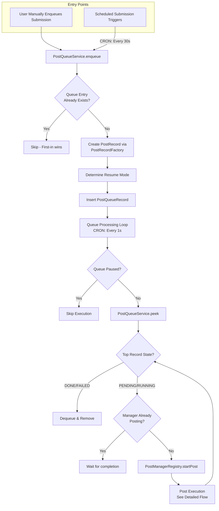
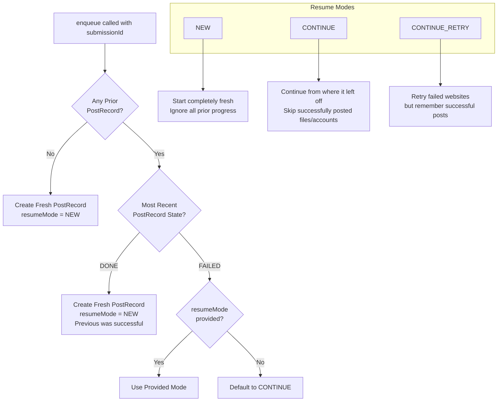
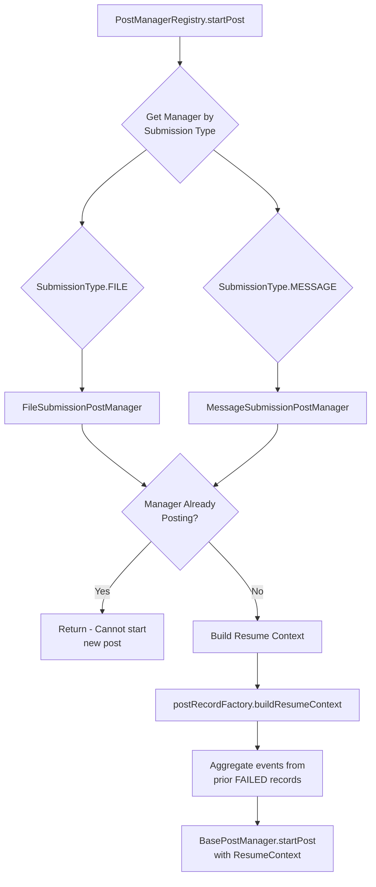
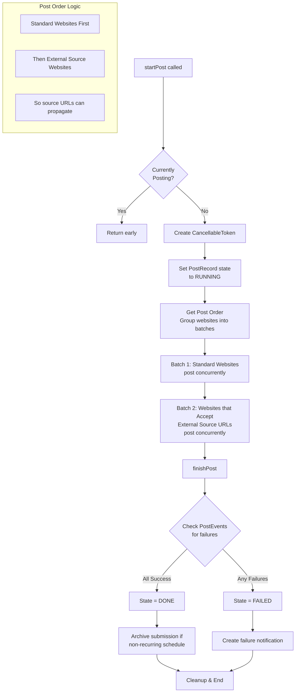
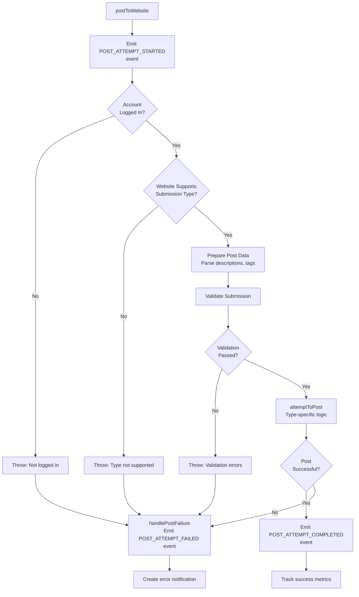
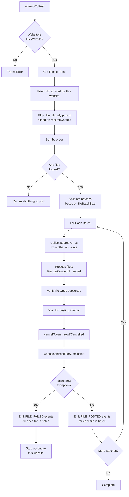
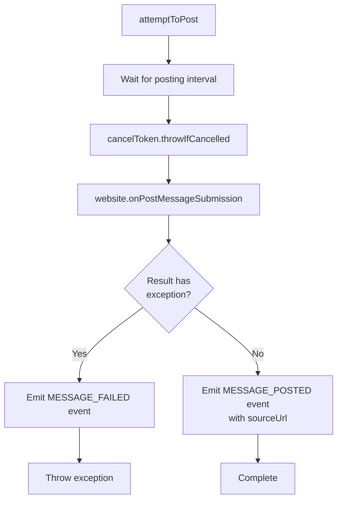
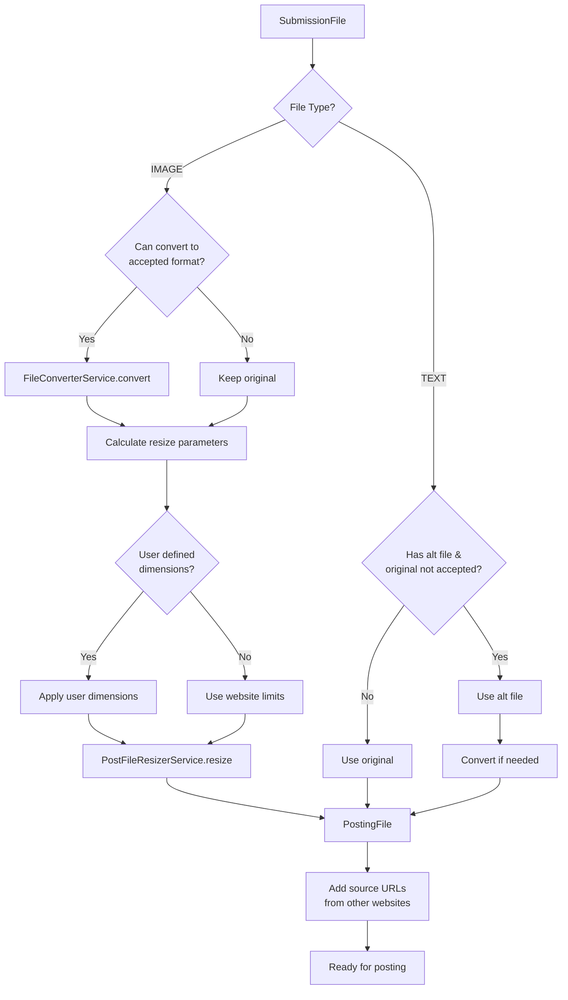
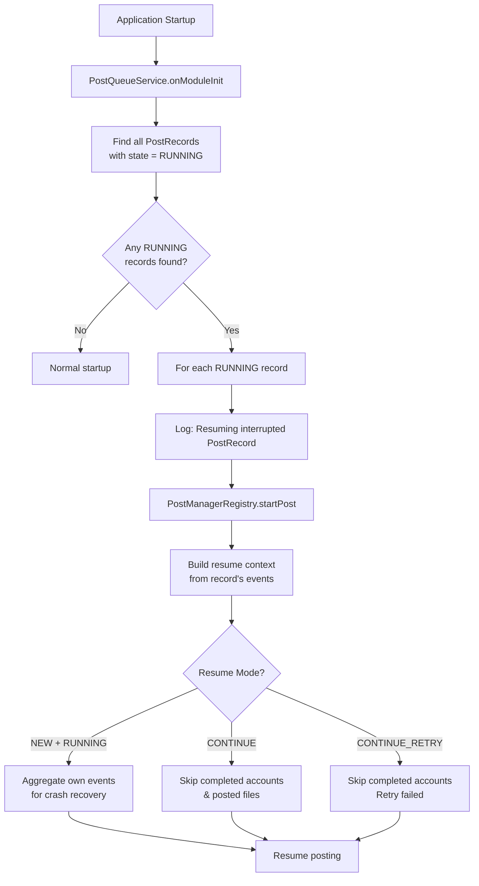
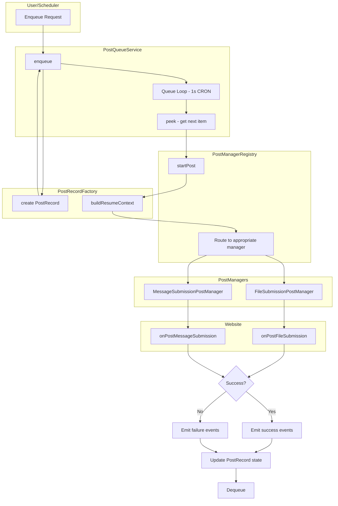

# Post Queue Flow Diagrams

This document provides comprehensive flow diagrams for submissions going through the post queue system in PostyBirb.

## 1. High-Level Overview

## 2. Resume Mode Logic

## 3. PostManagerRegistry & Manager Selection

## 4. Post Execution Flow (BasePostManager)

## 5. Website Posting Flow (per website)

## 6. File Submission Flow (FileSubmissionPostManager)

## 7. Message Submission Flow (MessageSubmissionPostManager)

## 8. File Processing Pipeline

## 9. Crash Recovery Flow

## 10. Complete End-to-End Flow

## Key Classes & Files Reference

| Component        | File                                                                                                  |
| ---------------- | ----------------------------------------------------------------------------------------------------- |
| Queue Management | `apps/client-server/src/app/post/services/post-queue/post-queue.service.ts`                           |
| Manager Registry | `apps/client-server/src/app/post/services/post-manager-v2/post-manager-registry.service.ts`           |
| Base Manager     | `apps/client-server/src/app/post/services/post-manager-v2/base-post-manager.service.ts`               |
| File Posting     | `apps/client-server/src/app/post/services/post-manager-v2/file-submission-post-manager.service.ts`    |
| Message Posting  | `apps/client-server/src/app/post/services/post-manager-v2/message-submission-post-manager.service.ts` |
| Record Factory   | `apps/client-server/src/app/post/services/post-record-factory/post-record-factory.service.ts`         |
| Legacy Manager   | `apps/client-server/src/app/post/services/post-manager/post-manager.service.ts`                       |
