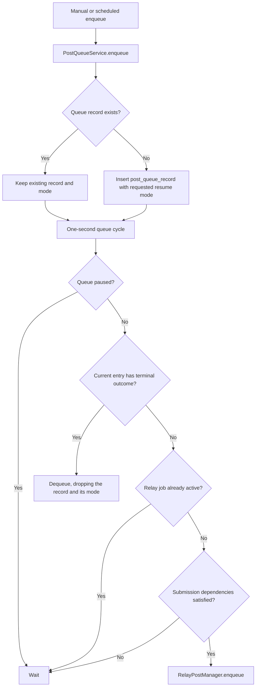
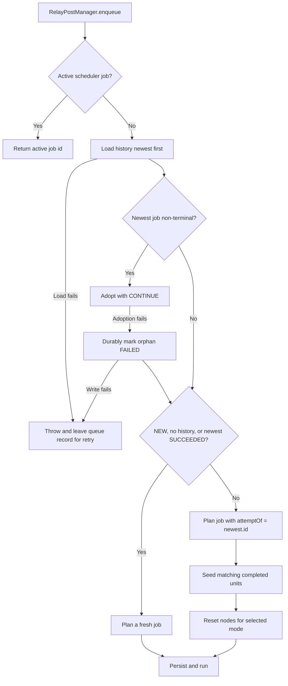
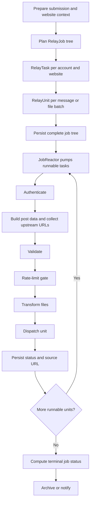
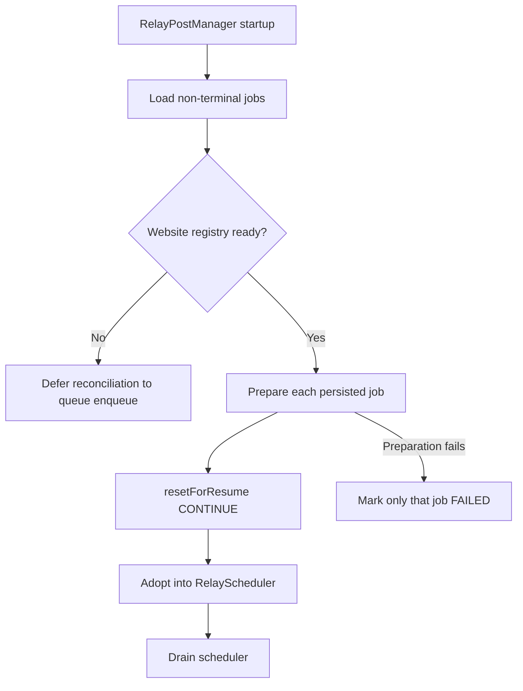

# Post Queue Flows

This document describes how submissions move through the current Relay posting
engine.

## 1. Queue Overview


```mermaid
flowchart TD
    A[Manual or scheduled enqueue] --> B[PostQueueService.enqueue]
    B --> C{Queue record exists?}
    C -->|Yes| D[Keep existing record and mode]
    C -->|No| E[Insert post_queue_record with requested resume mode]

    D --> G[One-second queue cycle]
    E --> G
    G --> H{Queue paused?}
    H -->|Yes| I[Wait]
    H -->|No| J{Current entry has terminal outcome?}
    J -->|Yes| K[Dequeue, dropping the record and its mode]
    J -->|No| L{Relay job already active?}
    L -->|Yes| I
    L -->|No| M{Submission dependencies satisfied?}
    M -->|No| I
    M -->|Yes| N[RelayPostManager.enqueue]
```

The first enqueue wins while a queue record exists. The selected resume mode is
stored on that record, so a restart before the job starts still honours the
choice. A record with no stored mode falls back to the engine default
(`CONTINUE`), and the mode is discarded with the record on dequeue.

## 2. Resume Modes

Each attempt is a separate `post_job` row. A resumed attempt points to the
immediately previous attempt through `attemptOf`; it does not mutate or walk an
origin chain. This one-level link is sufficient because inherited unit state is
persisted on every new attempt before it runs.


```mermaid
flowchart TD
    A[RelayPostManager.enqueue] --> B{Active scheduler job?}
    B -->|Yes| C[Return active job id]
    B -->|No| D[Load history newest first]
    D -->|Load fails| E[Throw and leave queue record for retry]

    D --> F{Newest job non-terminal?}
    F -->|Yes| G[Adopt with CONTINUE]
    G -->|Adoption fails| H[Durably mark orphan FAILED]
    H -->|Write fails| E

    F -->|No| I{NEW, no history, or newest SUCCEEDED?}
    H --> I
    I -->|Yes| J[Plan a fresh job]
    I -->|No| K[Plan job with attemptOf = newest.id]
    K --> L[Seed matching completed units]
    L --> M[Reset nodes for selected mode]
    J --> N[Persist and run]
    M --> N
```

| Mode | Behaviour |
| ---- | --------- |
| `NEW` | Start every current destination and batch from scratch. |
| `CONTINUE` | Keep the files that already posted and shard only the rest. |
| `CONTINUE_RETRY` | Keep fully completed websites, but restart an incomplete website from its first file. |

Delivered work is tracked per *file*, not per batch. A resume carries over the
previous attempt's completed units, drops any file they posted that the
submission no longer has, and shards the remaining files into fresh batches
appended after them. Adding, removing or reordering files therefore shifts batch
boundaries without making an already-posted file look unposted, so nothing is
sent twice. Files added since the attempt go out as an additional post on a
website that already finished — they cannot join the post that already exists.

## 3. Relay Execution


```mermaid
flowchart TD
    A[Prepare submission and website context] --> B[Plan RelayJob tree]
    B --> C[RelayTask per account and website]
    C --> D[RelayUnit per message or file batch]
    D --> E[Persist complete job tree]
    E --> F[JobReactor pumps runnable tasks]

    F --> G[Authenticate]
    G --> H[Build post data and collect upstream URLs]
    H --> I[Validate]
    I --> J[Rate-limit gate]
    J --> K[Transform files]
    K --> L[Dispatch unit]
    L --> M[Persist status and source URL]
    M --> N{More runnable units?}
    N -->|Yes| F
    N -->|No| O[Compute terminal job status]
    O --> P[Archive or notify]
```

Tasks that accept external source URLs depend on upstream tasks. The reactor
waits for those dependencies to settle, then injects their task source URLs
when building post data. Source URLs inherited during a resume come only from
completed batches that still exist in the current plan.

## 4. Crash Recovery


```mermaid
flowchart TD
    A[RelayPostManager startup] --> B[Load non-terminal jobs]
    B --> C{Website registry ready?}
    C -->|No| D[Defer reconciliation to queue enqueue]
    C -->|Yes| E[Prepare each persisted job]
    E --> F[resetForResume CONTINUE]
    F --> G[Adopt into RelayScheduler]
    G --> H[Drain scheduler]
    E -->|Preparation fails| I[Mark only that job FAILED]
```

The queue also reconciles the newest persisted attempt before creating a job.
It never revives an older non-terminal row behind a newer terminal attempt. An
untracked newest job is adopted; if it cannot be adopted, it must be durably
failed before a replacement attempt can be created.

## 5. Attempt Model

```text
Attempt #1  attemptOf: null  FAILED
  - website A: batches 1 and 2 SUCCEEDED, batch 3 FAILED
  - website B: SUCCEEDED

Attempt #2  attemptOf: #1    FAILED
  - inherits A batches 1 and 2 and all of website B
  - posts A batch 3, then another destination fails

Attempt #3  attemptOf: #2    SUCCEEDED
  - inherits the accumulated state already persisted by #2
```

Only the newest attempt is consulted. The queue scopes terminal outcomes to its
own creation time, so an older attempt cannot make a newly queued post appear
finished.

## Key Files

| Responsibility | File |
| -------------- | ---- |
| Queue lifecycle | `apps/client-server/src/app/post/services/post-queue/post-queue.service.ts` |
| Relay orchestration and recovery | `apps/client-server/src/app/post/engine/post-manager.service.ts` |
| Planning, seeding, and resume reset | `apps/client-server/src/app/post/engine/planner.ts` |
| Job registry and lifecycle | `apps/client-server/src/app/post/engine/scheduler.ts` |
| Per-job task reactor | `apps/client-server/src/app/post/engine/job-reactor.ts` |
| Unit execution pipeline | `apps/client-server/src/app/post/engine/task-pass.ts` |
| Relay persistence | `apps/client-server/src/app/post/engine/persistence.ts` |