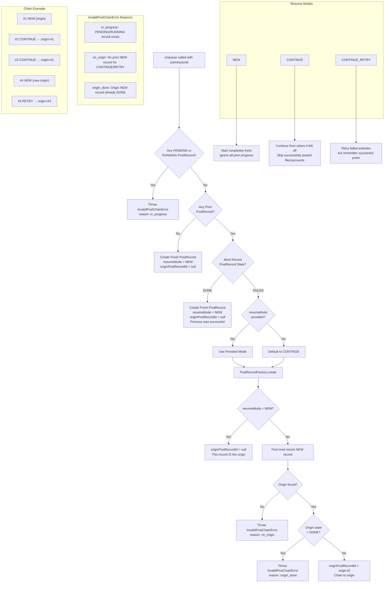
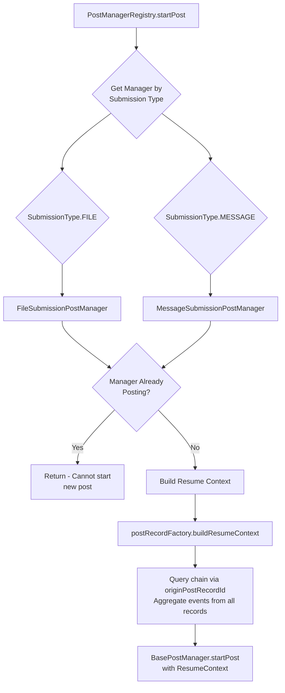
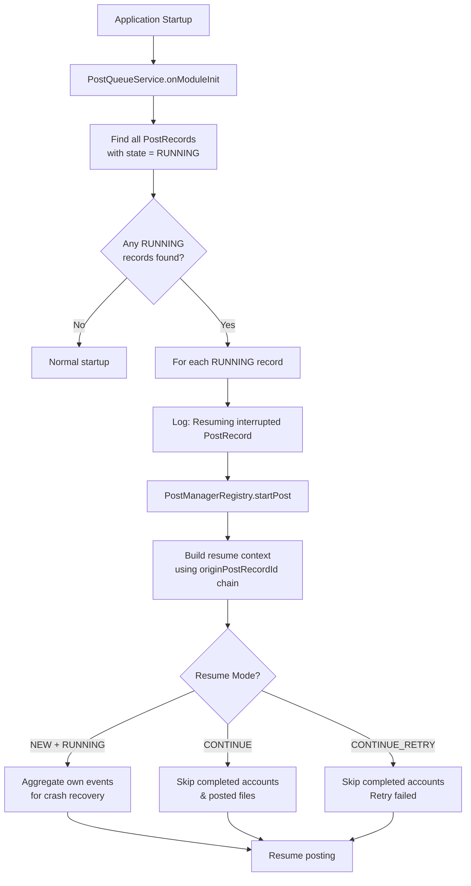

# Post Queue Flow Diagrams

This document provides comprehensive flow diagrams for submissions going through the post queue system in PostyBirb.

## 1. High-Level Overview


## 2. Resume Mode Logic



## 3. PostManagerRegistry & Manager Selection



## 4. Post Execution Flow (BasePostManager)


## 5. Website Posting Flow (per website)


## 6. File Submission Flow (FileSubmissionPostManager)


## 7. Message Submission Flow (MessageSubmissionPostManager)


## 8. File Processing Pipeline


## 9. Crash Recovery Flow



## 10. Complete End-to-End Flow


## Key Classes & Files Reference

| Component           | File                                                                                                  |
| ------------------- | ----------------------------------------------------------------------------------------------------- |
| Queue Management    | `apps/client-server/src/app/post/services/post-queue/post-queue.service.ts`                           |
| Manager Registry    | `apps/client-server/src/app/post/services/post-manager-v2/post-manager-registry.service.ts`           |
| Base Manager        | `apps/client-server/src/app/post/services/post-manager-v2/base-post-manager.service.ts`               |
| File Posting        | `apps/client-server/src/app/post/services/post-manager-v2/file-submission-post-manager.service.ts`    |
| Message Posting     | `apps/client-server/src/app/post/services/post-manager-v2/message-submission-post-manager.service.ts` |
| Record Factory      | `apps/client-server/src/app/post/services/post-record-factory/post-record-factory.service.ts`         |
| Chain Error         | `apps/client-server/src/app/post/errors/invalid-post-chain.error.ts`                                  |
| Legacy Manager      | `apps/client-server/src/app/post/services/post-manager/post-manager.service.ts`                       |

## PostRecord Chain Model

PostRecords are linked via `originPostRecordId` to form posting chains:

```text
Chain 1 (Group):
┌─────────────────────────────────────────────────────────────────┐
│  #1 NEW                    ← origin (originPostRecordId: null)  │
│  #2 CONTINUE → origin=#1   ← chains to #1                       │
│  #3 CONTINUE → origin=#1   ← chains to #1 (DONE closes chain)   │
└─────────────────────────────────────────────────────────────────┘

Chain 2 (Self-contained):
┌─────────────────────────────────────────────────────────────────┐
│  #4 NEW (DONE)             ← origin, completed in one attempt   │
└─────────────────────────────────────────────────────────────────┘

Chain 3 (Active):
┌─────────────────────────────────────────────────────────────────┐
│  #5 NEW                    ← origin (originPostRecordId: null)  │
│  #6 RETRY → origin=#5      ← chains to #5                       │
└─────────────────────────────────────────────────────────────────┘
```

**Query for chain aggregation:**

```sql
SELECT * FROM post_record
WHERE id = :originId OR originPostRecordId = :originId
ORDER BY createdAt ASC
```

## PostRecord Creation Guards

Before creating a new PostRecord, the factory performs the following validations:

| Guard                 | Condition                                    | Error Reason    |
| --------------------- | -------------------------------------------- | --------------- |
| In-Progress Check     | PENDING or RUNNING record exists             | `in_progress`   |
| Origin Exists         | CONTINUE/RETRY without prior NEW record      | `no_origin`     |
| Origin Open           | CONTINUE/RETRY when origin is DONE           | `origin_done`   |

These guards ensure:

1. **No concurrent posting** - Only one PostRecord can be PENDING/RUNNING per submission at a time
2. **Valid chain linkage** - CONTINUE/RETRY modes must have a valid origin to chain from
3. **Chain closure respected** - Once an origin is DONE, a new chain (NEW mode) must be started
